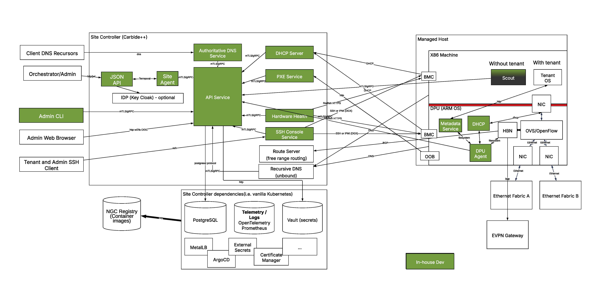

# What is NICo?

NICo (NCX Infra Controller) is an open source suite of microservices for site-local, zero-trust bare-metal lifecycle management. It automates hardware discovery, firmware validation, DPU provisioning, network isolation, and tenant sanitization — enabling NVIDIA Cloud Partners (NCPs) and infrastructure operators to stand up and operate GB200/GB300-class AI infrastructure at scale.

NICo is open source under the Apache 2.0 license.

## The problem NICo solves

Operating GPU infrastructure at scale exposes a consistent set of operational gaps:

- **Rack bringup takes too long.** Hardware discovery, validation, firmware alignment, and network setup are largely manual. Every cluster ends up slightly different, and bringing a new rack online can take days or weeks.
- **Multi-tenancy is risky without hardened isolation.** Sharing GPU fleets safely requires strong workload isolation, predictable performance, and reliable tenant transitions. Without it, teams either over-provision or accept security risk.
- **Reusing bare metal between tenants is slow and error-prone.** Sanitization, attestation, and trust re-establishment often require custom scripts and manual steps, creating operational drift and risk.
- **Firmware and configuration drift is constant.** Across mixed hardware generations, BIOS, firmware, NIC drivers, and network configs diverge — making it difficult to maintain a stable, ISV-ready baseline.

NICo exists to make GPU infrastructure behave like a cloud primitive, not a bespoke ops project.

## What NICo does

NICo runs as a collection of microservices on a Kubernetes cluster co-located in the datacenter it manages (the "site controller"). It manages the full lifecycle of bare-metal hosts — from initial rack discovery through tenant provisioning, ongoing operations, and secure reuse.

Each managed host is a **BlueField DPU + host server pair**. The DPU acts as the enforcement boundary for network isolation and security; NICo provisions and manages it directly, independently of what runs on the host.

NICo's core responsibilities:

- Provision and manage DPU OS, firmware, and HBN configuration
- Maintain hardware inventory of all managed hosts
- Automate discovery, validation, and attestation via Redfish (out-of-band)
- Monitor hardware health continuously and react to health state changes
- Manage host firmware (UEFI, BMC) and enforce security lockdown
- Allocate IP addresses, configure BGP routing, and manage DNS
- Enforce network isolation across Ethernet, InfiniBand, and NVLink planes
- Orchestrate host provisioning (PXE/iPXE), tenant release, and sanitization

## Architecture overview



## Where NICo fits

NICo sits below Kubernetes and platform layers. It exposes clean REST and gRPC APIs that higher-level systems — BMaaS, VMaaS, orchestration engines, ISV control planes — can consume directly. It does not dictate how scheduling, tenancy policy, or workloads are managed above it.

```
┌─────────────────────────────────────┐
│   ISV / NCP Control Plane           │
├─────────────────────────────────────┤
│   Kubernetes / BMaaS / VMaaS        │
├─────────────────────────────────────┤
│   NICo  ◄── you are here            │
├─────────────────────────────────────┤
│   BlueField DPU + Host Hardware     │
└─────────────────────────────────────┘
```

NICo is the layer that makes the hardware predictable, repeatable, and safe — so the layers above it can treat bare metal as a reliable building block.
